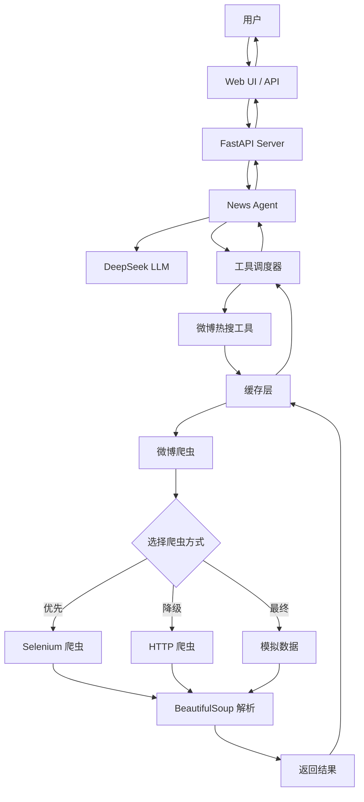

# News Agent

> 基于 LangChain 和 DeepSeek 的智能新闻助手 Agent

一个功能完善的新闻助手，支持查询微博热搜，具备智能对话、流式输出、自动缓存、重试机制等企业级特性。


## ✨ 核心特性

### 🤖 智能对话
- 基于 LangChain 框架的智能 Agent
- 使用 DeepSeek 模型进行高质量对话
- 支持多轮对话上下文管理
- 流式输出响应，提升用户体验

### 🛠️ 工具集成
- 微博热搜查询（Agent 自动判断何时调用）
- 可扩展的工具系统，易于添加新的数据源
- LangChain Tool 原生集成

### 🚀 性能优化
- **智能缓存**：避免重复请求，提升响应速度
- **重试机制**：网络错误自动重试，提高可靠性
- **降级策略**：Selenium → HTTP → 模拟数据，确保服务可用性

### 🌐 Web 界面
- 简洁美观的 Web UI
- RESTful API 接口
- 完整的 API 文档（Swagger/OpenAPI）

### 🧪 质量保证
- 完整的单元测试和集成测试
- 类型注解覆盖（Python 3.12+）
- 结构化日志系统
- 代码质量保障

## 如何启动

### 前置要求

1. **Python 3.10+**
   - 检查版本: `python --version`

2. **uv 包管理器** (推荐)
   - 安装: `curl -LsSf https://astral.sh/uv/install.sh | sh`
   - 或 macOS: `brew install uv`

3. **Chrome 浏览器** (Selenium 爬虫需要)
   - **macOS**: `brew install --cask google-chrome`
   - **Ubuntu**: `sudo apt-get install google-chrome-stable`
   - **Windows**: 从 https://www.google.com/chrome/ 下载

### 安装步骤

1. **克隆项目**
   ```bash
   git clone https://github.com/mitrecx/news-agent.git
   cd news-agent
   ```

2. **安装依赖**
   ```bash
   uv sync
   ```

3. **配置环境变量**
   ```bash
   # 复制环境变量模板
   cp .env.example .env

   # 编辑 .env 文件，填入你的 DeepSeek API Key
   # DEEPSEEK_API_KEY=your_actual_api_key_here
   ```

### 启动服务

```bash
uv run python run.py
```

启动成功后会看到类似输出：
```
✓ News Agent initialized with model: deepseek-chat
✓ Loaded 1 tool(s): ['fetch_weibo_hot_search']
INFO:     Uvicorn running on http://0.0.0.0:8000
```

### 访问应用

- **Web 界面**: http://localhost:8000
- **API 文档**: http://localhost:8000/docs
- **健康检查**: http://localhost:8000/health

### 测试微博热搜

在 Web 界面中输入以下任一问题：
- "今天有什么热搜？"
- "微博上最近有什么热门话题？"
- "看看现在的热搜榜"

Agent 会自动识别并调用微博热搜工具获取最新数据。


## 📋 项目结构

```
news-agent/
├── src/
│   ├── agent/              # Agent 核心逻辑
│   │   ├── base.py         # Agent 实现（支持工具绑定）
│   │   └── config.py       # 配置管理
│   ├── api/                # API 服务
│   │   ├── server.py       # FastAPI 服务器
│   │   └── models.py       # 请求/响应模型（Pydantic）
│   ├── tools/              # LangChain 工具集成
│   │   ├── __init__.py     # 工具导出
│   │   └── weibo.py        # 微博热搜爬虫（支持 Selenium）
│   ├── utils/              # 工具模块
│   │   ├── cache.py        # 缓存管理（TTL、线程安全）
│   │   ├── retry.py        # 重试机制（指数退避）
│   │   └── logger.py       # 日志配置
│   ├── config.py           # 全局配置
│   └── main.py             # 入口文件
├── tests/                  # 测试套件
│   ├── conftest.py         # pytest 配置
│   ├── test_utils.py       # 工具模块测试
│   ├── test_weibo_scraper.py  # 爬虫测试
│   └── test_integration.py # 集成测试
├── docs/                   # 文档（可选）
├── .env.example            # 环境变量示例
├── pyproject.toml          # 项目配置和依赖
├── README.md               # 项目说明
├── CONTRIBUTING.md         # 贡献指南
└── run.py                  # 启动脚本
```

## 配置说明

| 环境变量 | 说明 | 默认值 |
|---------|------|--------|
| `DEEPSEEK_API_KEY` | DeepSeek API 密钥 | 必填 |
| `DEEPSEEK_BASE_URL` | DeepSeek API 地址 | `https://api.deepseek.com/v1` |
| `HOST` | 服务监听地址 | `0.0.0.0` |
| `PORT` | 服务端口 | `8000` |
| `AGENT_MODEL` | 使用的模型 | `deepseek-chat` |
| `AGENT_TEMPERATURE` | 模型温度参数 | `0.7` |
| `AGENT_MAX_TOKENS` | 最大 token 数 | `2000` |
| `WEIBO_SCRAPER_TIMEOUT` | 微博爬虫超时时间（秒） | `10` |
| `WEIBO_USE_SELENIUM` | 是否使用 Selenium 爬虫 | `true` |

## 🏗️ 系统架构



## 🔧 技术实现

### 核心技术栈

- **Python 3.12+**：现代 Python 特性（类型注解、async/await）
- **FastAPI**：高性能 Web 框架
- **LangChain**：LLM 应用框架
- **DeepSeek API**：大语言模型
- **Pydantic**：数据验证和序列化
- **httpx**：异步 HTTP 客户端
- **BeautifulSoup4**：HTML 解析
- **Selenium**：浏览器自动化（可选）
- **pytest**：测试框架

### 微博热搜爬虫

支持三种爬虫方式，自动降级：

1. **Selenium 爬虫（推荐）**
   - 使用真实浏览器，能处理复杂反爬
   - 自动下载 ChromeDriver
   - 无头模式运行
   - 能绕过大部分反爬机制

2. **HTTP 爬虫**
   - 使用 `httpx` + `BeautifulSoup`
   - 轻量级，速度快
   - 可能被反爬拦截

3. **模拟数据**
   - 当所有爬虫方式失败时使用
   - 确保服务始终可用
   - 用于开发和测试

### 性能优化特性

#### 1. 智能缓存

```python
from src.utils.cache import cached

@cached(ttl=300, key_prefix="weibo")  # 缓存 5 分钟
async def fetch_weibo_hot_search(limit: int = 10) -> str:
    # 实现逻辑...
    pass
```

- **TTL（Time To Live）**：自动过期
- **线程安全**：支持并发访问
- **LRU 淘汰**：自动清理旧缓存
- **灵活配置**：可为每个函数设置不同的缓存策略

#### 2. 重试机制

```python
from src.utils.retry import retry_with_backoff, RetryConfig

@retry_with_backoff(config=RetryConfig(max_attempts=3, min_wait=2.0))
async def fetch_external_api():
    # 实现逻辑...
    pass
```

- **指数退避**：避免服务器压力
- **最大重试次数**：可配置
- **异常过滤**：只重试特定类型的错误
- **日志记录**：完整的重试日志

#### 3. 结构化日志

```python
from src.utils.logger import get_logger

logger = get_logger(__name__)
logger.info("操作成功")
logger.error("操作失败", extra={"context": "additional data"})
```

- **彩色输出**：开发环境友好
- **文件日志**：生产环境持久化
- **日志级别**：DEBUG、INFO、WARNING、ERROR、CRITICAL
- **结构化数据**：支持 JSON 格式

### LangChain 工具集成

微博热搜功能作为 LangChain Tool 集成：

```python
from langchain_core.tools import tool

@tool
async def fetch_weibo_hot_search(limit: int = 10) -> str:
    """
    获取微博热搜榜，返回当前最热门的话题

    当用户询问以下内容时，使用此工具：
    - "微博热搜"、"热搜榜"、"热门话题"
    - "今天有什么热点"、"最近有什么新闻"
    """
    # 实现逻辑...
    pass
```

Agent 会自动判断用户意图，当用户询问热搜相关问题时自动调用该工具。

## 🧪 测试

项目包含完整的测试套件：

```bash
# 运行所有测试
uv run pytest

# 运行特定测试文件
uv run pytest tests/test_utils.py

# 运行测试并显示覆盖率
uv run pytest --cov=src --cov-report=html

# 查看 HTML 覆盖率报告
open htmlcov/index.html
```

### 测试类型

- **单元测试**：测试独立模块和函数
- **集成测试**：测试模块间的交互
- **异步测试**：使用 pytest-asyncio 测试异步代码

### 测试覆盖率

当前测试覆盖率目标：> 80%

## 📚 API 文档

### 启动服务后访问

- **交互式 API 文档**：http://localhost:8000/docs
- **ReDoc 文档**：http://localhost:8000/redoc
- **OpenAPI Schema**：http://localhost:8000/openapi.json

### 核心 API 端点

#### POST /api/chat
发送聊天消息并获取响应

**请求体：**
```json
{
  "message": "今天有什么热搜？",
  "history": [
    {"role": "user", "content": "你好"},
    {"role": "assistant", "content": "你好！有什么可以帮助你的吗？"}
  ]
}
```

**响应：**
```json
{
  "response": "根据微博热搜榜，今天的热门话题包括..."
}
```

#### POST /api/chat/stream
流式聊天响应（Server-Sent Events）

#### GET /health
健康检查端点

**响应：**
```json
{
  "status": "ok",
  "agent_ready": true
}
```

## 🚀 后期扩展计划

- [x] 微博热搜爬虫工具
- [x] 智能缓存机制
- [x] 重试机制
- [x] 完整测试套件
- [ ] 其他新闻源（知乎、Hacker News、Reddit）
- [ ] 数据持久化（SQLite/PostgreSQL）
- [ ] 定时任务调度（APScheduler）
- [ ] 邮件通知功能
- [ ] 多轮对话优化
- [ ] 用户认证和授权
- [ ] Docker 支持
- [ ] Kubernetes 部署配置

## 🤝 贡献指南

我们欢迎所有形式的贡献！

### 快速开始

1. Fork 项目到你的 GitHub 账户
2. 创建功能分支：`git checkout -b feature/your-feature`
3. 提交更改：`git commit -m 'feat: 添加新功能'`
4. 推送到分支：`git push origin feature/your-feature`
5. 创建 Pull Request

详细的贡献指南请参考 [CONTRIBUTING.md](CONTRIBUTING.md)

## 📝 开发规范

### 代码风格

- 遵循 PEP 8 规范
- 使用类型注解（Python 3.12+）
- 编写文档字符串
- 保持代码简洁和可读性

### Git 提交规范

使用语义化提交信息：

- `feat:` 新功能
- `fix:` Bug 修复
- `docs:` 文档更新
- `style:` 代码格式（不影响功能）
- `refactor:` 重构
- `test:` 添加测试
- `chore:` 构建/工具更新

示例：
```bash
git commit -m "feat: 添加知乎热搜爬虫功能"
git commit -m "fix: 修复缓存过期问题"
git commit -m "docs: 更新 README.md"
```

## 📄 许可证

本项目采用 MIT 许可证。详见 [LICENSE](LICENSE) 文件。

## 🙏 致谢

- [LangChain](https://github.com/langchain-ai/langchain) - 强大的 LLM 应用框架
- [DeepSeek](https://www.deepseek.com/) - 提供高质量的大语言模型 API
- [FastAPI](https://fastapi.tiangolo.com/) - 现代化的 Python Web 框架

## 📞 联系方式

- 问题反馈：[GitHub Issues](https://github.com/mitrecx/news-agent/issues)
- 功能建议：[GitHub Discussions](https://github.com/mitrecx/news-agent/discussions)

---

⭐ 如果这个项目对你有帮助，请给一个 Star！

